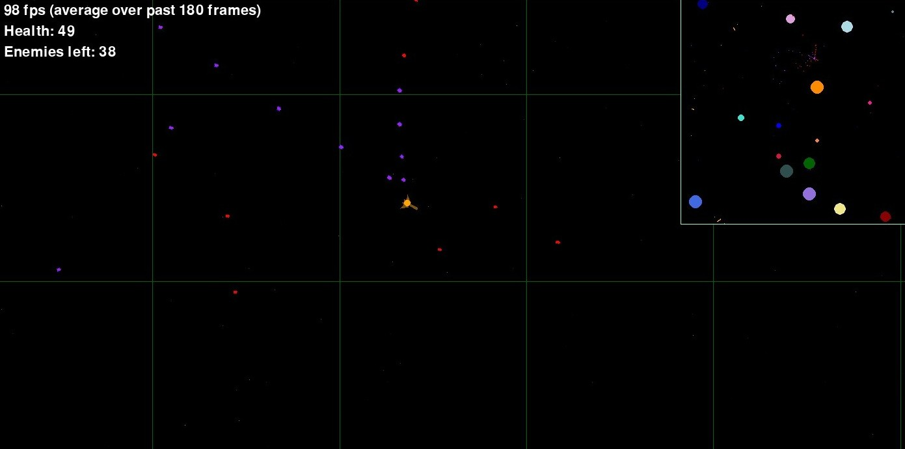

Fun small game we're making. Give us feedback, or just play the game.

You can play the game in the web [here](https://tim2othy.github.io/spacegame/build/web) or locally by following the instructions below.
I'd recommend playing it locally, as then there are many more features and it runs smoother.

## How to Play
- If there is one player, move with arrow keys, shoot with return, shoot flares with M.
- If there are two players:
    - Player 1 moves with arrow keys, shoots with return,
    - Player 2 moves with WASD, shoots with space.

I recommend playing in small mode. Just trying to defeat the 4 enemies is quite fun.


## Building
Requires [uv](https://docs.astral.sh/uv/), which installs all dependencies, including python, automatically. Running the game locally:

```sh
uv run src/main.py
```

Build the game for the web using pygbag (while this is running, open <localhost:8000>):

```sh
uv run pygbag src/main.py
```

Run tests with:

```sh
uv run pytest
```
