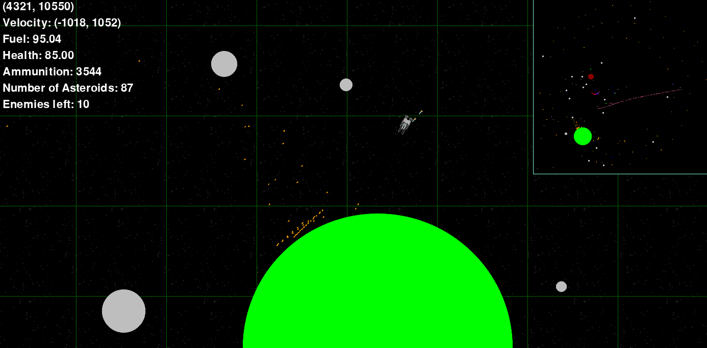

Fun small game we're making. Give us feedback, or just play the game.

# How to start the game

Install dependencies:
```
pip install -r requirements.txt
```
Run with:
```
py main.py
```

# How to play the game
If there is one player, move with arrow keys, shoot with return.

If there are two players:
- Player one moves with arrow keys, shoots with return,
- Player two moves with wasd, shoots with space.

In `constants.py` you can change the size of the map, whether there are one or two players, if there is just one or if there are multiple planets and whether one can die, by setting `SMALL_MODE`, `MULTI_MODE`, `ORBIT_MODE` or `INVINCIBLE_MODE` respectivly, to either `True` or `False`.